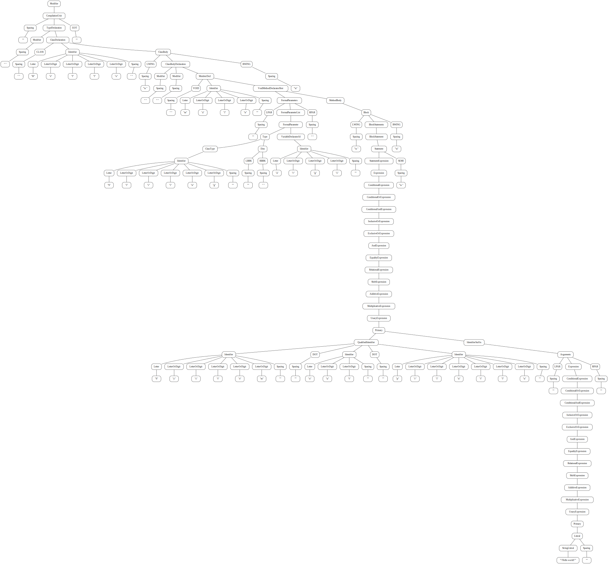

# GPeg AST viewer tool

Build:

```
go build
```

Usage:

```
./gpeg-ast -peg test/java.peg test/test.java > ast.dot
dot -Tpdf ast.dot > ast.pdf
```

or you can use `dot -Tsvg` to generate an SVG file like the one already present
in `test/`, rendered below:


